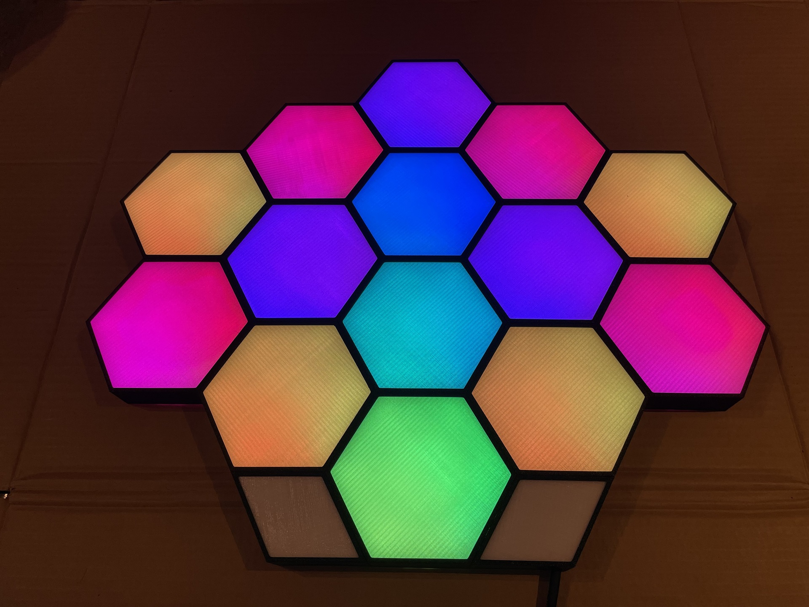
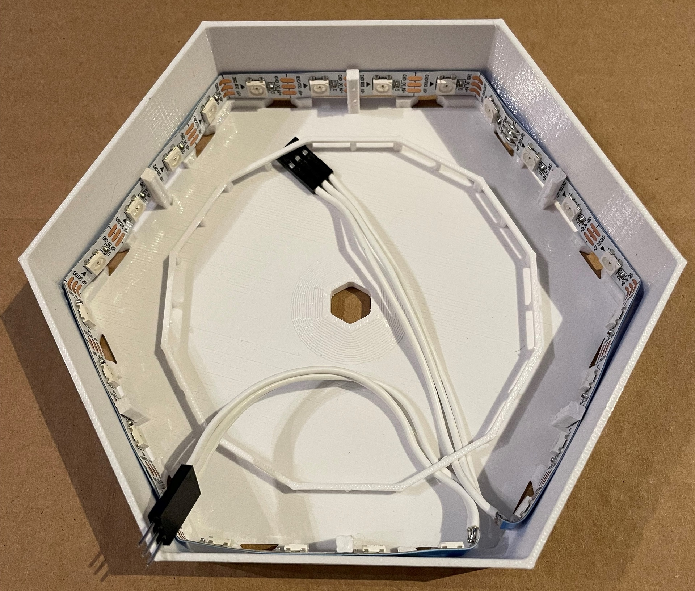
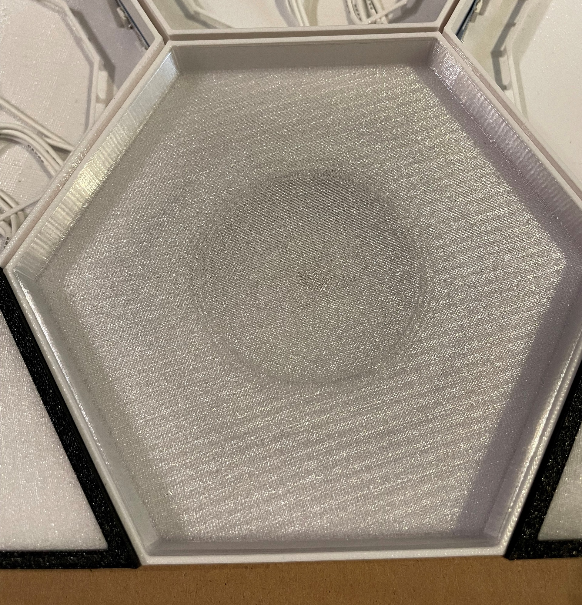
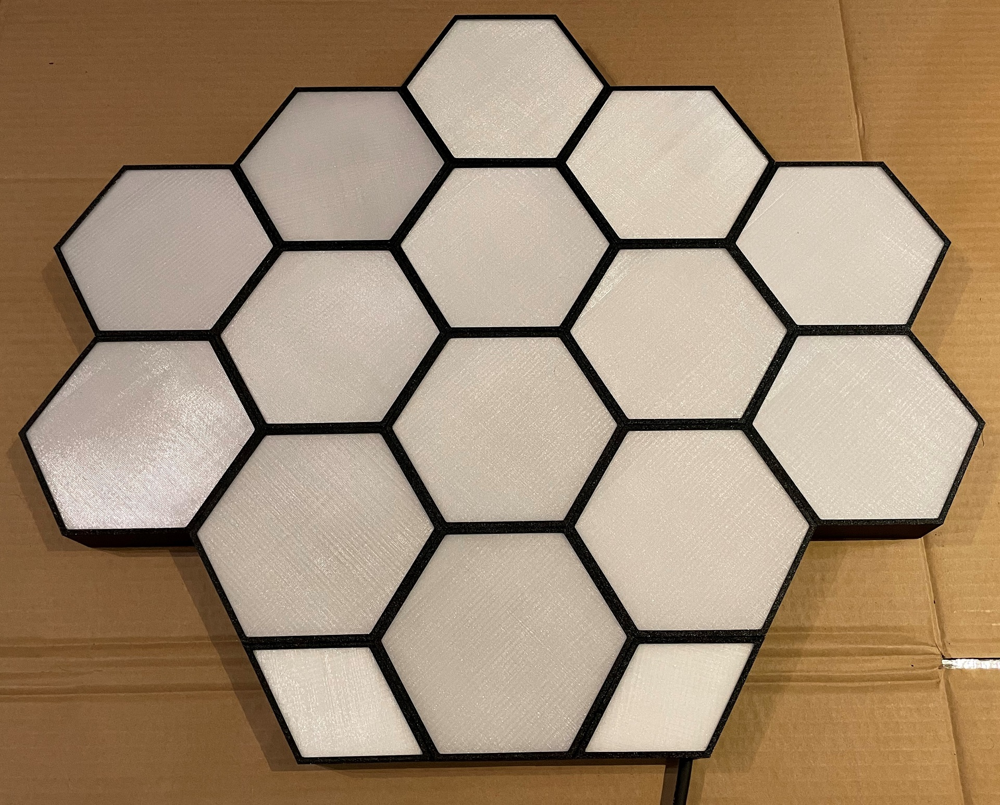
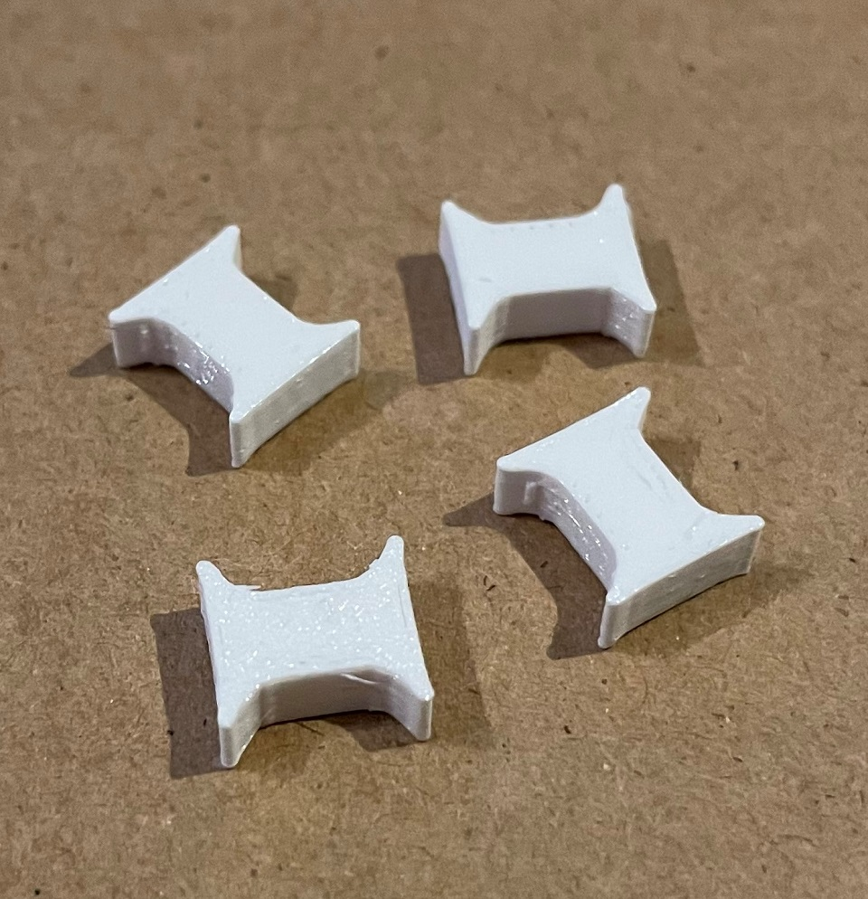
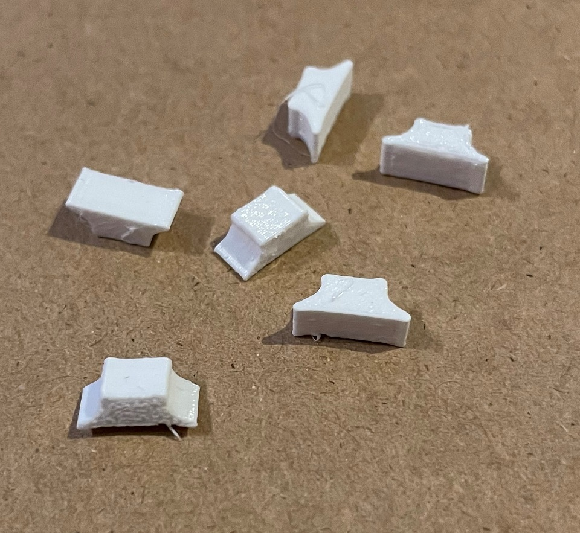
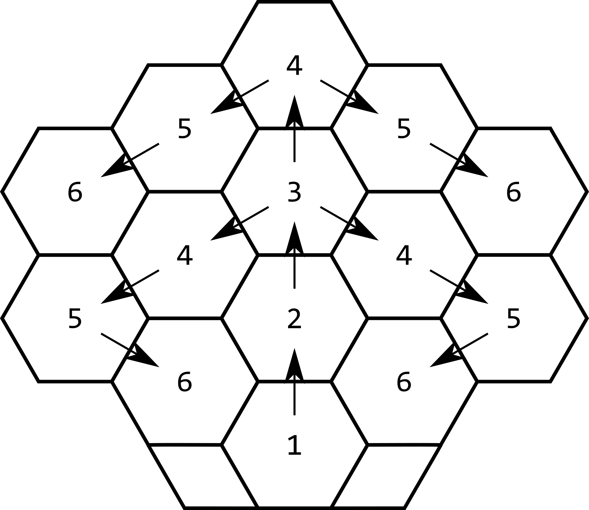
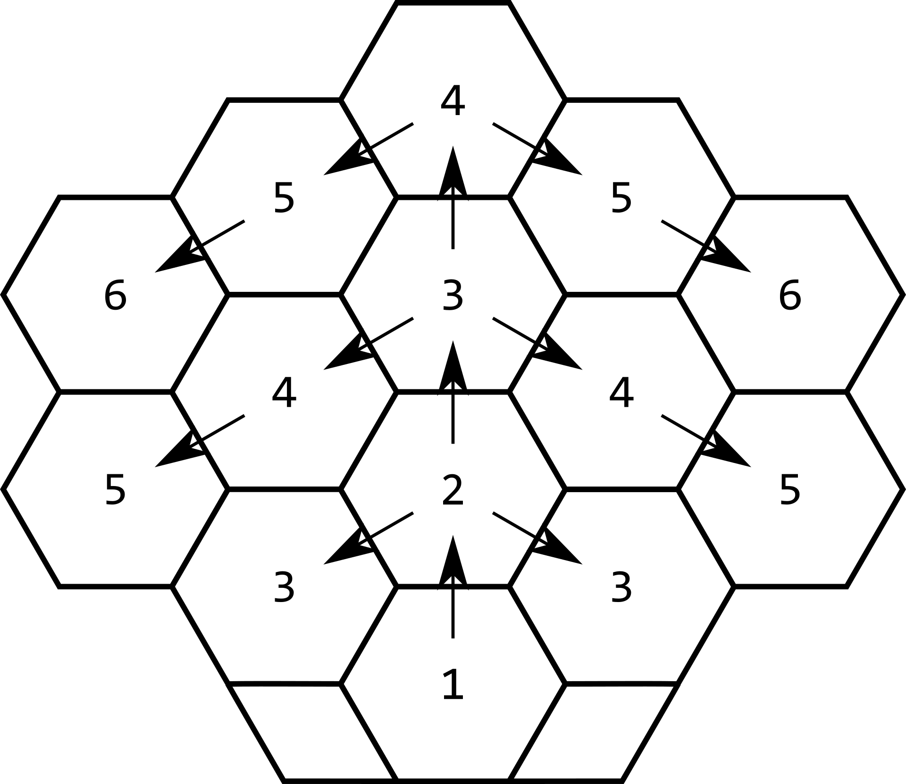
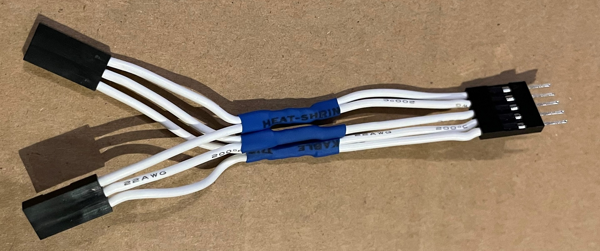

# Hexaleafs - Yet another take on Nanoleaf-inspired Hexagons :)

## Aim
- Selfmade Nanoleaf-like lamp-thingy :)
- Good light diffusion with invisible LED-spots
- Print as many parts as possible using a 3d printer

## My result
- Good light diffusion by using printed diffusors
- Generic design with single hexagons, that can be interlinked - even though, once assembled, the design can't be change anymore
- Easy setup using WLED

## BOM for building the Hexaleafs as shown in the pictures
### Parts to buy
- WS2812B LED-Strip with white PCB and 30 or 60 LEDs/m. Length depending on your design (30 LEDs/m = 12 LEDs per hex, 60 LEDs/m = 24 LEDs per hex. In my case I used a 5m and a 1m strip of these 60LEDs/m strips: https://www.amazon.de/gp/product/B01CDTEG1O/ref=ppx_yo_dt_b_asin_title_o03_s00?ie=UTF8&psc=1)
- Black Filament (I used this PETG: https://www.dasfilament.de/filament-spulen/petg-1-75-mm/158/petg-filament-1-75-mm-schwarz)
- White Filament (I used this PETG: https://www.dasfilament.de/filament-spulen/petg-1-75-mm/157/petg-filament-1-75-mm-weiss)
- Clear Filament (I used this PETG: https://www.dasfilament.de/filament-spulen/petg-1-75-mm/136/petg-filament-1-75-mm-natur)
- Flexible, white wire (I used ~10 meters 22AWG)
- ESP32 (pin spacing: 52mm, 23mm, I used this one: https://www.banggood.com/ESP32-Development-Board-WiFi+bluetooth-Ultra-Low-Power-Consumption-Dual-Cores-ESP-32-ESP-32S-Board-Geekcreit-for-Arduino-products-that-work-with-official-Arduino-boards-p-1109512.html?cur_warehouse=CN&ID=6300464&rmmds=search If you can’t find one matching the pins spacing, you could also use just 2 of the 4 pins to hold the ESP32 and remove the unneeded pins or customize the .scad-file)
- Crimping-Tool and DuPont-Connectors (2x 3 pin connectors per hex, plus some additional connectors for power distribution)
- 5V power supply (I’m currently using this 8A power supply: https://www.amazon.de/LED-Netzteil-MeanWell-LPV-60-5-Schaltnetzteil/dp/B00MWQF08C/ref=sr_1_5?keywords=meanwell+5v+8a&qid=1642237318&sr=8-5 which is still underpowered for the huge amount of LEDs… Be careful when configuring the power limit in WLED!)
- 2-wire cable to connect the power supply to the ESP32
- (2-wire cable to connect the power supply to mains – depending on power supply)
- some shrinking tube
- soldering iron and solder

### Parts to print
#### White:
- 14x body.stl
- ~70x connector – c 0.2.stl
- ~60x connectorBlind – c 0.2.stl
- 1x rhombusBody – no electronics.stl
- 1x rhombusBody – with electronics.stl
- 2x rhombusFace – 0.8mm.stl

#### Black:
- 4x cap 111111.stl
- 3x cap 011111.stl
- 2x cap 001111.stl
- 5x cap 000111.stl
- 1x rhombusCap – no electronics.stl
- 1x rhombusCap – with electronics.stl
- 2x rhombusFace – 0.8mm.stl

#### Clear:
- 14x diffusor – 5mm.stl
- 14x face 0.8mm.stl
- 14x spacer.stl
- 2x rhombusFace – 0.8mm.stl

---
## Structure of a Hexaleaf
The printed body with its LED strip already inserted

After adding diffusor and spacer
> Caution! The diffusor must be inserted with the flat side UP.

After adding face and cap (I don't have pics of a single, assembled hexaleaf... sorry)

The whole assembly is held toghether by the connectors, unused connector slots are closed with the "blind" connectors

## LED-Strip-Connections
For smooth animations and effects using WLED and the layout shown here, it's important to have a symmetrical layout for the LED-strips.
The trick used here is wiring some of the strips in parallel, so the respective hexaleafs always perform the same effects.

The connection-layout I used looks as follows
Especially the hexaleafs marked with 3 and 4 are important, because they each contain a split, where the strips start to be wired in parallel.
- Caution! The parallel connection of the following LED-strips must occur at the output of the respective hexaleafs LED-strip, not on the input side.

Another layout I came up with after finishing this project looks like this:

Example for a Y-splitter with additional power injection, where the middle pin is Data and the outer pins are 5V and GND

## Parts needed for one hexaleaf
#### Electronics:
- LED-strip (12 LEDs @ 30 LEDs/m, 24 LEDs @ 60 LEDs/m)
- 2x 3-Pin DuPont-Connector
- (Optional) Y-splitter to connect LED-strips in parallel
- (Optional) Power-Adapter to inject 5V to various points in your design

#### White:
- 1x body.stl
- 12x connectors (blind) – amount of blind and standard connectors depends on amount of connected hexes

#### Black:
- 1x cap xxxxxx.stl (which stl file depends on connected hexes, 0 = no outlets to next hex, 1 = includes outlets to next hex)

#### Clear:
- 1x diffusor – 5mm.stl
- 1x face 0.8mm.stl
- 1x spacer.stl

