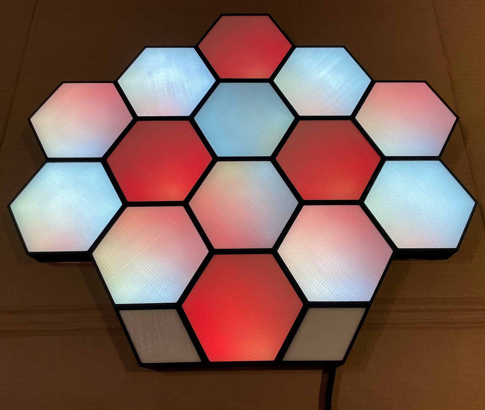
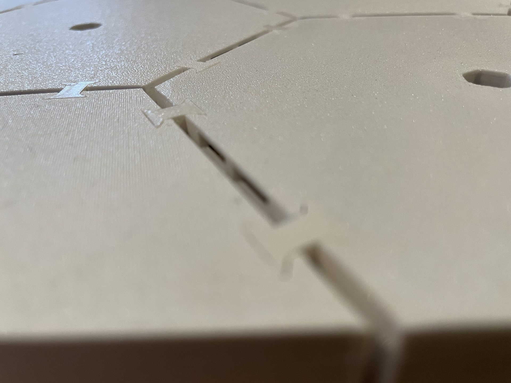

# Hexaleafs - Yet another take on Nanoleaf-inspired Hexagons :)

## Aim
- Selfmade Nanoleaf-like lamp-thingy :)
- Good light diffusion with invisible LED-spots
- Print as many parts as possible using a 3d printer

## My result
- Good light diffusion by using printed diffusors
- Generic design with single hexagons, that can be interlinked - even though, once assembled, the design can't be change anymore
- Easy setup using WLED

## BOM for building the Hexaleafs as shown in the pictures
### Parts to buy
- WS2812B LED-Strip with white PCB and 30 or 60 LEDs/m. Length depending on your design (30 LEDs/m = 12 LEDs per hex, 60 LEDs/m = 24 LEDs per hex. In my case I used a 5m and a 1m strip of these 60LEDs/m strips: https://www.amazon.de/gp/product/B01CDTEG1O/ref=ppx_yo_dt_b_asin_title_o03_s00?ie=UTF8&psc=1)
- Black Filament (I used this PETG: https://www.dasfilament.de/filament-spulen/petg-1-75-mm/158/petg-filament-1-75-mm-schwarz)
- White Filament (I used this PETG: https://www.dasfilament.de/filament-spulen/petg-1-75-mm/157/petg-filament-1-75-mm-weiss)
- Clear Filament (I used this PETG: https://www.dasfilament.de/filament-spulen/petg-1-75-mm/136/petg-filament-1-75-mm-natur)
- Flexible, white wire (I used ~10 meters 22AWG)
- ESP32 (pin spacing: 52mm, 23mm, I used this one: https://www.banggood.com/ESP32-Development-Board-WiFi+bluetooth-Ultra-Low-Power-Consumption-Dual-Cores-ESP-32-ESP-32S-Board-Geekcreit-for-Arduino-products-that-work-with-official-Arduino-boards-p-1109512.html?cur_warehouse=CN&ID=6300464&rmmds=search If you can’t find one matching the pins spacing, you could also use just 2 of the 4 pins to hold the ESP32 and remove the unneeded pins or customize the .scad-file)
- Crimping-Tool and DuPont-Connectors (2x 3 pin connectors per hex, plus some additional connectors for power distribution)
- 5V power supply (I’m currently using this 8A power supply: https://www.amazon.de/LED-Netzteil-MeanWell-LPV-60-5-Schaltnetzteil/dp/B00MWQF08C/ref=sr_1_5?keywords=meanwell+5v+8a&qid=1642237318&sr=8-5 which is still underpowered for the huge amount of LEDs… Be careful when configuring the power limit in WLED!)
- 1000µF capacitor
- 2-wire cable to connect the power supply to the ESP32
- (2-wire cable to connect the power supply to mains – depending on power supply)
- some shrinking tube
- soldering iron and solder

### Parts to print
#### White:
- 14x [body.stl](./stl/clearance_0.3mm/body.stl)
- ~70x [connector_c_0.1mm_default.stl](./stl/clearance_0.3mm/connector_c_0.1mm_default.stl)
- ~60x [connectorBlind_c_0.1mm_default.stl](./stl/clearance_0.3mm/connectorBlind_c_0.1mm_default.stl)
- 1x [rhombusBody_no_electronics.stl](./stl/clearance_0.3mm/rhombusBody_no_electronics.stl)
- 1x [rhombusBody_with_electronics.stl](./stl/clearance_0.3mm/rhombusBody_with_electronics.stl)
- 2x [rhombusFace_0.8mm.stl](./stl/clearance_0.3mm/rhombusFace_0.8mm.stl)

**Additional information:**
The mm-value in the filename of the connectors show the clearance of these components. 0.1mm was the value I used so that the connectors are a snug fit. You might need to use a different file here. Example: connectorBlind_c_0.1mm_default.stl - 0.1mm clearance.
**connectorBlind** is used only to block light on the outer leafs of your structure.

#### Black:
- 4x [cap_111111.stl](./stl/clearance_0.3mm/cap_111111.stl)
- 3x [cap_011111.stl](./stl/clearance_0.3mm/cap_011111.stl)
- 2x [cap_001111.stl](./stl/clearance_0.3mm/cap_001111.stl)
- 5x [cap_000111.stl](./stl/clearance_0.3mm/cap_000111.stl)
- 1x [rhombusCap_no_electronics.stl](./stl/clearance_0.3mm/rhombusCap_no_electronics.stl)
- 1x [rhombusCap_with_electronics.stl](./stl/clearance_0.3mm/rhombusCap_with_electronics.stl)
- 2x [rhombusFace_0.8mm.stl](./stl/clearance_0.3mm/rhombusFace_0.8mm.stl)

Additional information:
The cap uses a bit masking in the filename. There are 6 sides of the cap. If the side covers the holes of the base there will be a 0 in the filename. If the holes are not covered and thus usable there will be a 1.
Example: cap_111111.stl - all 6 sides are accessible / cap_000111.stl - 3 sides are covered, 3 sides are accessible
This is important as you do not want open holes at the edge of your structure as it may leak light.

#### Clear:
- 14x [diffusor_5mm.stl](./stl/clearance_0.3mm/diffusor_5mm.stl) - !! 50% infill, rectlinear infill pattern !!
- 14x [face_0.8mm.stl](./stl/clearance_0.3mm/face_0.8mm.stl)
- 14x [spacer_0.8mm.stl](./stl/clearance_0.3mm/spacer_0.8mm.stl)
- 2x [rhombusFace_0.8mm.stl](./stl/clearance_0.3mm/rhombusFace_0.8mm.stl)

### Print settings
#### Default
Most of the parts don't require specific settings. Just use your default profile.

#### Diffusor
When printing the diffusor, make sure, to set the infill to 50% rectlinear. This way you get a proper diffusion.

---
## General Structure of a Hexaleaf
The printed body with its LED strip already inserted

After adding diffusor and spacer
> Caution! The diffusor must be inserted with the flat side UP.

After adding face and cap (I don't have pics of a single, assembled hexaleaf... sorry)

The whole assembly is held toghether by the connectors, unused connector slots are closed with the "blind" connectors

# Build Guide
**Before you begin, make sure you've ordered and printed all the parts mentioned in the BOM**

This guide consists of all the steps necessary, to build the following hexaleaf-layout:

## LED-Strip & body preparation
To get your LED-Strips ready, they need to be cut, have wires soldered on and finally be bent.
1. Cut your strip in pieces of 12 (@30LEDs/m) or 24 (@60LEDs/m) LEDs each. You need as many strip-pieces, as you have bodies. **Caution!** The long LED strips you can buy, are made up of several shorter strips, that are soldered together. These solder joints can't get bent and are a severe problem, if they occur in one of the corners of a hexaleaf. To prevent this issue, I checked my strips before cutting them. Count the number of LEDs from the beginning of the strip to the first joint, where two strips are soldered together. If the number is even, remove the first LED from your strip. This way, the solder joints will never be in a corner and, if you have a 60 LEDs/m strip, also never be at one of the posts, holding the strip in place.
2. Prepare 6 strips of wire with a length of 10-11cm, using the white wire. Strip the insulation on one side for about 3-5mm, so can solder the wire easily to the pads on the LED-strips. On the other side, remove just a little bit of shielding (~2mm) as preparation for the crimping. Coat the side with more insulation removed with a nice layer of tin and crimp a DuPont-connector to the other side. In the end, you'll need 3 male and 3 female connectors. Don't add the connector housing yet, as the wires are easier to solder to the strip without it.
3. Solder the 3 wires with the **male** DuPont-connectors to the **input side** of your LED-strip pieces. On most of the strips, the input side is marked with DI, while the output is marked with DO (besides VCC and GND). You can also recognize the input by the little arrow, printed on the pcb. If it points away from the solder pads, it's the input side, if it points towards the solder pads, it's the output side. After you finished the input-side, solder the remaining 3 wires, with the **female** DuPont-connectors, to the **output side** of the strip.
4. Insert the 3 male, as well as the 3 female connectors in a 3-pin-housing each. When doing this step, make sure you are using the same wire order for each and every connector. My connector housings had a little arrow embedded on one of the outermost pins. So I build up every connector by inserting GND into the slot with the arrow, the Data-Pin into the center slot and finally VCC into the remaining slot. This way, when connecting the hexaleafs later on, you can be sure which pin is which and don't get confused. Just plug "the arrows" together :)
5. After the wires are soldered to the strip, it's a good idea to pre-bend your strip. This makes the assembly way easier. To do this, use a ruler and, depending on your strip type, count 2 (30 LEDs/m) or 4 (60 LEDs/m) LEDs from the beginning of the strip. Place the edge of the ruler on the middle of the solder pads, that come **after** the 2nd/4th LED, with the LEDs facing towards you. Now bend the strip upwards and toward you. Repeat this until you made 5 bends.
Your strip should now look something like this: 
6. Insert the finished LED strip in one of your prepared bodies. Make sure, to insert each and every strip in the same direction. From input to output go either clockwise or counter-clockwise around the body, but don't mix up both directions in different bodies! While doing so, you'll notice, that the beginning and end of each strip doesn't fit that well, because of the solder joints where the wires are attached. To circumvent this issue, simply bend the strips here as well, so that your finished body looks like this: 
7. Repeat for each of the LED strip pieces/bodies you need.

## Combining the bodies / assembling the layout
1. Lay out the prepared body-parts in the layout you want to use. While doing so, make sure, that the start/end-corner (where each strip starts and ends) of each hexaleaf is facing the same direction. This way, the effects, the hexaleafs will play later on, will all start in the same spot of each hexaleaf and travel in the same way through each hexaleaf, as well as through your layout. In my case, I put all start/end-corners to the lower right, as I felt it looked the nicest. Also, don't forget to include the [rhombusBody_with_electronics](./stl/clearance_0.3mm/rhombusBody_with_electronics.stl) in your layout, as it is mandatory for storing the ESP.
2. Now start by taking one of the layed out bodies and insert 2 of the printed [connectors](./stl/clearance_0.3mm/connector_c_0.1mm_default.stl) on each side, where another body or a rhombus body will be connected. I inserted the connectors from the bottom, without turning the respective body around. This way, I made sure I don't accidentially rotate something or make any other layout-mistakes.
3. Now take one of the bodies, that should connect to the one you just prepared and just clip them together. After this, add the connectors to this new body, as needed. It might look something like this:  And later like this: 
4. Work your way through the whole layout, until all bodies are connected.
5. As soon as all bodies are connected, you can turn the whole thing around to make sure all connectors are sitting tight and flat. If some of the connectors are sticking out a bit, push them in, so the surface of the back gets nice and flat. Also, put [blind connectors](./stl/clearance_0.3mm/connectorBlind_c_0.1mm_default.stl) and all the remaining connector slots. This way, you minimize light leakage in the finished assembly. My finnished assembly looked like this from the back:  With nice and flat connectors: 
6. You can now turn the whole assembly around again and start working on the LED-Strip connections.

## LED-Strip-Connections
For smooth animations and effects using WLED and the layout shown here, it's important to have a symmetrical layout for the LED-strips.
The trick used here is wiring some of the strips in parallel, so the respective hexaleafs always perform the same effects.

### Some words on power distribution
One downside of the WS2812B LED-strips is the fact, that the power distribution through a long strip isn't that good. This often results in a yellow, the orange, then red tint in the LED color, the further the LED is away from the beginning of the strip.  
To prevent this, you can inject additional power, to make sure there is an even distribution throughout the whole strip. In this case, the additional power injections will be, where one strip is split up in several parallel strips, as well on the end of the strips.

### Y-splitters
The y-splitters are needed, to wire the strips in parallel and also offer a good opportunity to inject some additional power. When building the layout shown in all the pictures, you'll need one splitter with 1 input and 2 outputs and 1 splitter with 1 input and 3 outputs (fyi: I ended up, not using the additional power injection in the 3-output-splitter, because of the additional injection already in place in the 2-output-splitter, that sits just one hexaleaf away).
Here is an example of a y-splitter with additional power injection.

To build such a splitter with power injection, you'll need 5 wires of ~4-5cm length for the input connector, as well as 3 wires of the same length for each output connector. Make sure to have your wires as short as possible, as this helps with hiding the splitter later on and minimizing its visible shadow in the finished hexaleaf. Strip one side of each wire for about 1cm and the opposite side for a few millimeters, so you can crimp on the connectors.  
Because the connection scheme used here, uses male plugs as inputs and female plugs as outputs, your splitter has to follow this rule too. Crimp 5 cables with male and the remainder with female DuPont connectors. As with the LED-Strips before, you want to solder the wires together, before you add the connector housings. This doesn't just make soldering easier, but also enables you to apply heatshrink tubing, after you are finished with soldering.  
Now you need to connect one of the input wires with "n" of the output wires, where "n" equals the number of outputs your splitter shall have. So, if you split up your connection to 2 hexaleafs, you'll need 2 output wires, if you split it up to 3 hexaleafs you'll need 3 input wires, etc. To make the handling easier, I bundled all of the output wires and twisted the stripped parts. After that, coat the stripped parts with some solder. If you are working on the Data-Line of your splitter, then take one, else two of the input wires with the male DuPont-connectors and repeat the process of twisting them together and applying a coat of solder. Now you should easily be able to solder the two already coated parts together. After soldering, make sure to add some heatshrink tubing, to prevent shorts, as well as to make sure the magic smoke stays inside of your electronics :)  
After preparing the wires for Data, GND and 5V of your splitter, you can add the connector housings. As with the LED-strips itself, the middle pin is Data and the outer pins are 5V and GND. Also make sure to follow the "arrow-rule" mentioned earlier and plug the GND-pins in the housing-slots on the side with the arrow and the 5V pins in the slots on the opposite side.

### Connection-layout
After alle the bodies are interconnected, you can start connecting the individual LED-strips. This step is very important, as it defines in which order your animations and effects will run over the whole layout.
The following image shows the connection scheme. The numbers and arrows within the single hexaleafs show the connection-order. So hexaleaf 1 is connected to 2, hexaleaf 2 to 3 and so on. Especially the hexaleaf marked with 3 and the upper one marked with 4 are important, because they each contain a split, where the strips start to be wired in parallel (as shown by 2 or 3 arrows pointing outward to the next hexaleafs).

The Rhombus in the bottom right corner is where your connection starts. It contains the male DuPont-plug, which will later get connected to your supply voltage and the ESP. The output of the corresponding strip is then connected to the strip-input of the hexaleaf above. The second LED-strips output is again connected to the input of the hexaleaf above, and so on.  
When following the layout shown here, the third hexaleaf is the point where you'll need your first y-splitter. Make sure to add the y-splitter at the **output** of the corresponding LED-strip and **not on the input**! For now, just don't mind the extra power injections on the splitters, as you'll connect them later on. Here is a closer look at the connections of the y-splitters:

Now work your way through the whole layout, until all LED-strips are connected to each other. Your result should look something like this:

### Other possible (connection-)layouts
Another connection-layout I came up with after finishing this project looks like this:

Also, here is an example for a completely different layout:

## Power distribution
Now that the LED-strips are connected, you should have 4 hexaleafs, with nothing connected on the output side, as well as the 2 splitters, waiting for an additional power injection.
In the following picture, the hexaleafs with unconnected outputs are marked green, the 2-output-splitter is marked yellow and the 3-output-splitter is marked red (because I ended up not using its additional power injection).

Get some more wire and measure the needed length for every connection. To do so, simply slide your wire through the layout, beginning from the rhomubs where the ESP will sit and ending in the hexaleaf or at the splitter, that needs the power injection. Then just cut the wire at the rhombus. Repeat this step for every power injection **twice** (for GND and 5V). Also make sure you don't mix up your already cut cables. To prevent this, I marked my wires with little dots.  
After cutting your wires to length, you'll need to solder your power splitters. When finished these will look something like this (also note the dots on the wires, so I don't mix them up):

(The DuPont connector for the intial hexaleaf is hardly visible in the picture... Sorry for that... But it's there, I promise :D)  
Additionally to the 5 wire-pairs, you already cut to length, you'll also need four short wires (~4-5cm), to power your ESP and the initial hexaleaf, as well as two thicker wires (~10-15cm), which will later get connected to your power source.  
Prepare the wires in the same way as you did for the Y-splitters (don't crimp on the DuPont connectors yet) and solder them all together. After applying heat shrink tubing, you can start with crimping on the DuPont connectors and inserting them into the housings. For the wires connecting to hexaleaf outputs (as additional power injection), use male connectors and for the wires connecting to a Y-splitter, the ESP or the initial hexaleaf, use female connectors. Repeat the whole step, so you end up with two power splitters (one for GND and one for 5V).
Now insert your power splitters into the assembly and connect them to the respective hexaleaf or Y-splitter.

## ESP32
To prepare your ESP32, you need to flash it with WLED. This has become really easy, using https://install.wled.me/  
Just open the site and follow the instructions. There's no need for handling and compiling and uploading the code yourself, anymore.  
After your ESP is flashed, insert it **upside down** into the corresponding rhombus. This way, it's easier to reach the pins. Now connect 5V and GND of the ESP with the respective DuPont connectors of your power splitters. Take special caution to not mix up your ESPs pins, especially, since it's inserted upside down! Finally connect the data pin of the first hexaleaf to the pin **D4** on your ESP. To do this, I used a male-to-female jumper cable I had laying around, but you also could crimp one quickly :)

## First Test
By now, you should have connected all the DuPont connectors and be left with the two thicker wires in the power splitters. Cut the two wires to be as short as possible, but as long as necessary, strip off some insulation and crimp on ferrules. Screw the wires, toghether with a 1000µF capacitor into a block terminal. Make sure to connect the capacitor in the right direction. Finally screw the wires, coming from your power supply, the the other side of the terminals.  
You are now ready for your first test. After plugging in your power supply and powering up the whole thing, at least some of the LEDs should turn orange.

## WLED setup
Until configured, WLED will open a hotspot, to which you can connect using your smartphone or any other wireless device. The default password for this hotspot is: **wled1234**  
Most of the times, it'll open the WLED configuration automatically, but if not, open the following URL in a browser on the connected device: http://4.3.2.1  
From here you can enter and save your own WiFi-credentials, so the ESP can connect to your local WiFi. After the ESP is connected to your WiFi, you might have to check your router for its IP. Enter the IP in your browser, to open the WLED interface.  
For WLED to use all of our LEDs, we'll have to change the LED preferences. In the WLED interface, click on "Config" and then on "LED Preferences". Here you can setup your total LED count, as well as your power limit. Caution, your total LED count is **NOT** the number of hexleafs times the number of LEDs per hexaleaf. Instead you have to find the longest series of hexaleafs from start to end. With the layout built here, this would be 6 hexaleafs. Starting from the center bottom, going upwards all to the top (= 4 hexaleafs), then to the left (or right), until the last hexaleaf in the chain (= another 2 hexaleafs). Multiplied by the number of LEDs in one hexaleaf, this is 144 LEDs for 60LEDs/m strips and 72 for 30LEDs/m strips. Enter the number matching your setup in the field for "Total LED count" in the WLED configuration.
Because we wired some strips in parallel, the power limit as calculated by WLED is also wrong. To correctly setup the "Maximum Current"-setting for your power supply, we need to calculate the matching value for your power supply first. Here's the formula:  
(Num LEDs as configured in WLED / real Num LEDs) * Max. Supply Current  
In my case, I configured WLED for 144 LEDs, used a real 336 LEDs and got a 8A (=8000mA) power supply. So my calulation is:  
(144 / 336) * 8000mA = 3428mA  
Enter your calculated value as "Maximum Current".  
**Caution! If you experience restarts of WLED (lamp turning off and on again), lower the "Maximum Current" in the settings.**  
After hitting "Save", all your LEDs should be showing a bright orange color.

## Final assembly
To finish everything up, insert the diffusors into all the hexaleafs. Make sure that the flat side of the diffusor points towards you, or they won't work properly (took me ages to find out). If you have to remove a diffusor again, you can use some duct tape to aid you, just like shown here:

After inserting the diffusors, add a spacer to each hexaleaf, to make sure the diffusor stays in place.  
Finally, insert a face in one of the caps, find a body with the matching outlets and gently push the cap over the body. You might need a bit of force, but carefully work your way around in circles, until the cap is nicely seated. Repeat this step for all the remaining bodies. Depending on how your faces turned out, you may want to align them in a way, that all printing lines face the same direction.  

## Congratulations, you have just finished your very own hexaleaf assembly.

# Parts needed for one hexaleaf
## Electronics:
- LED-strip (12 LEDs @ 30 LEDs/m, 24 LEDs @ 60 LEDs/m) - obviously 60 LEDs/m is much brighter
- 2x 3-Pin DuPont-Connector
- (Optional) Y-splitter to connect LED-strips in parallel
- (Optional) Power-Adapter to inject 5V to various points in your design

## White:
- 1x body.stl
- 12x connectors (blind) – amount of blind and standard connectors depends on amount of connected hexes

## Black:
- 1x cap xxxxxx.stl (which stl file depends on connected hexes, 0 = no outlets to next hex, 1 = includes outlets to next hex)

## Clear:
- 1x diffusor – 5mm.stl
- 1x face 0.8mm.stl
- 1x spacer.stl

